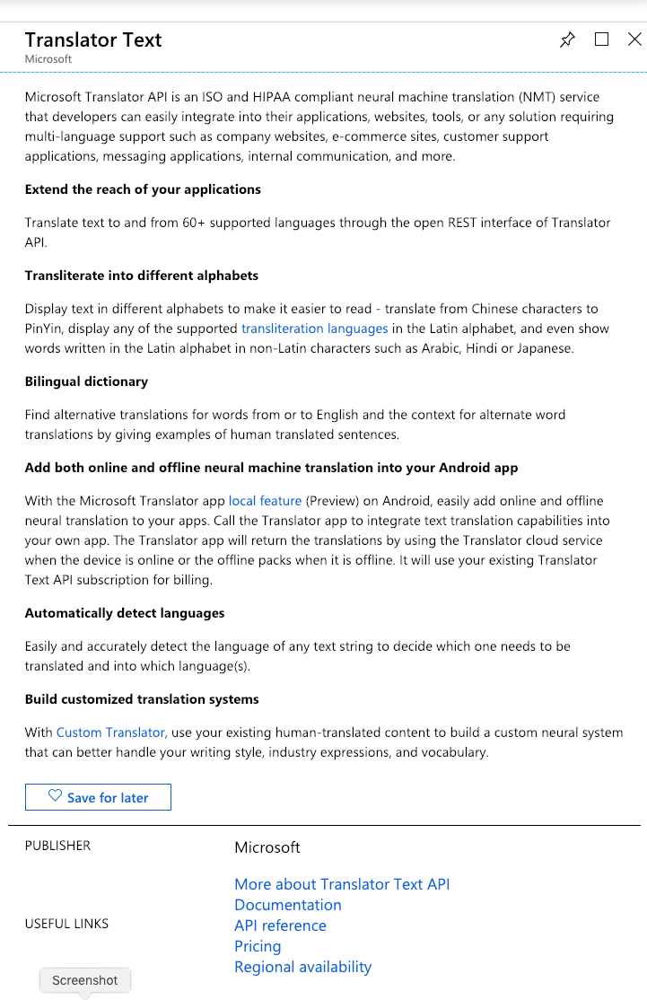
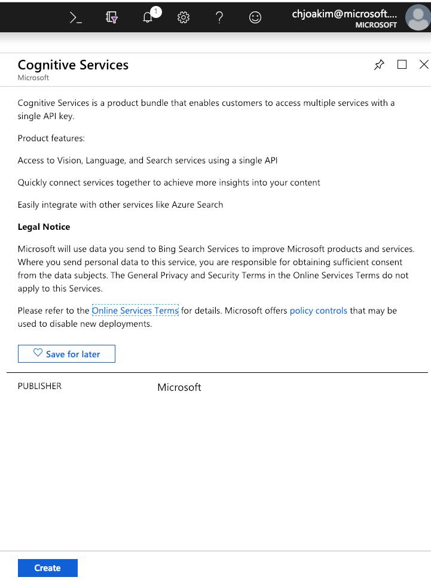
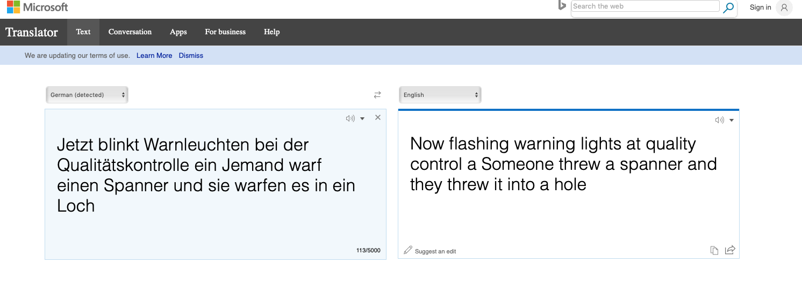
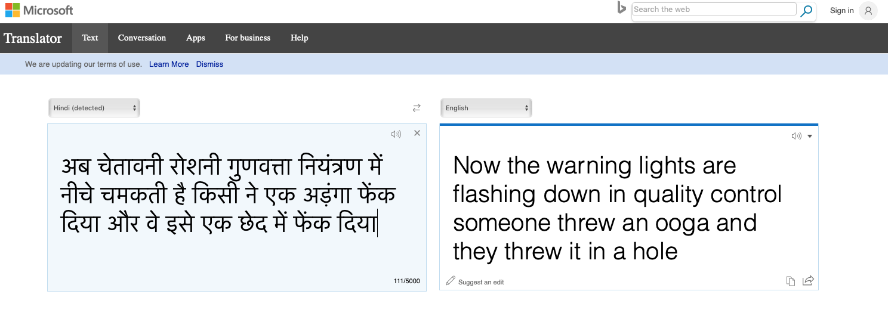

# azure-cognitive-services

Azure Cognitive Services, Text Translation, and Speech-to-Text

## Links

- https://github.com/cjoakim/azure-cognitive-services
- https://azure.microsoft.com/en-us/services/cognitive-services
- https://azure.microsoft.com/en-us/services/cognitive-services/translator-text-api/
- https://docs.microsoft.com/en-us/azure/cognitive-services/Translator/language-support
- https://docs.microsoft.com/en-us/azure/cognitive-services/translator/quickstart-nodejs-translate
- https://azure.microsoft.com/en-us/pricing/details/cognitive-services/translator-text-api/
- https://azure.microsoft.com/en-us/pricing/details/cognitive-services/speech-services/
- https://www.bing.com/translator
- https://www.npmjs.com/package/request
- https://www.youtube.com/watch?v=g3X3rKtruSg
- https://docs.microsoft.com/en-us/azure/cognitive-services/speech-service/batch-transcription
- https://docs.microsoft.com/en-us/azure/cognitive-services/speech-service/quickstart-js-node

## Azure PaaS Services Used

- Azure Cognitive Services
- Azure Text Translator
- Azure Speech





## Environment Variables 

Set these environment variables per the names and keys of your above Azure PaaS services.

```
AZURE_COGSVCS_KEY
AZURE_COGSVCS_NAME
AZURE_SPEECH_NAME
AZURE_SPEECH_KEY
AZURE_TEXTTRANS_BASEURL
AZURE_TEXTTRANS_KEY
AZURE_TEXTTRANS_NAME
```

## Text Translation Examples

This codebase currently uses **Node.js** and the npm **request** library to make HTTP calls
to these PaaS services.  Any HTTP-capable programming language may be used.  DotNet Core
and Java examples will be added to this repo in the coming weeks/months.

### Node.js Use

```
# Setup:
$ cd node
$ npm install
$ mkdir tmp

# Command-line Format:
$ node main.js translate_doc <data-json-file> <num-lines> <to-lang>

# Examples - translate first 2 lines of song lyrics into German and Hindi.
$ node main.js translate_doc Dire-Straits_Industrial-Disease 2 de
$ node main.js translate_doc Dire-Straits_Industrial-Disease 2 hi
```

The main.js program assumes that **data-json-file** is a JSON file in the data/
directory and contains an array of lines, named **text_lines** to be translated.
The other attributes in the JSON file are just metadata.

For example:
```
{
    "pk": "Dire-Straits_Industrial-Disease",
    "artist": "Dire Straits",
    "title": "Industrial Disease",
    "file": "Dire-Straits_Industrial-Disease.json",
    "text_lines": [
        "Now warning lights are flashing down at Quality Control",
        "Somebody threw a spanner and they threw it in a hole",
...
```

### Example Output 

```
[
  {
    "detectedLanguage": {
      "language": "en",
      "score": 1
    },
    "translations": [
      {
        "text": "Jetzt blinkt Warnleuchten bei der Qualitätskontrolle ein Jemand warf 
                 einen Spanner und sie warfen es in ein Loch",
        "to": "de"
      }
    ],
    "source_text": "Now warning lights are flashing down at Quality Control Somebody threw 
                    a spanner and they threw it in a hole"
  }
]

[
  {
    "detectedLanguage": {
      "language": "en",
      "score": 1
    },
    "translations": [
      {
        "text": "अब चेतावनी रोशनी गुणवत्ता नियंत्रण में नीचे चमकती है किसी ने एक अड़ंगा फेंक दिया और वे इसे एक छेद में फेंक दिया",
        "to": "hi"
      }
    ],
    "source_text": "Now warning lights are flashing down at Quality Control Somebody threw a spanner and they threw it in a hole"
  }
]
```


### Verify the Text Translation with the Bing Translator

See https://www.bing.com/translator

Original English text:

> Now warning lights are flashing down at Quality Control
> Somebody threw a spanner and they threw it in a hole




