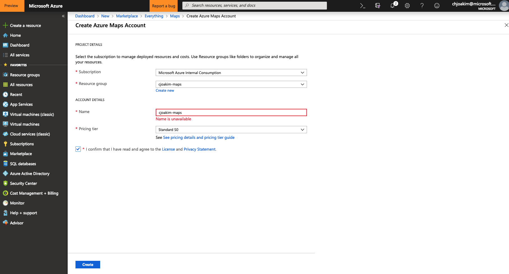
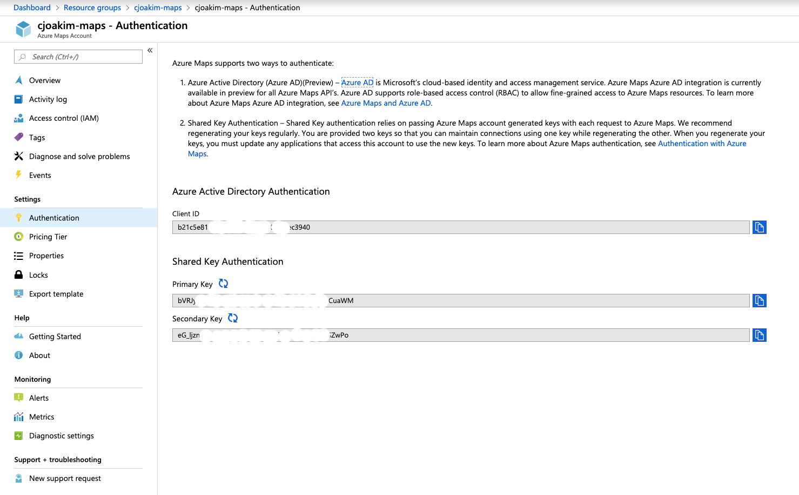

# Azure Maps with Python HTTP Client and CosmosDB

## Links

- Azure Maps: https://azure.microsoft.com/en-us/services/azure-maps/
- Azure Maps API: https://docs.microsoft.com/en-us/rest/api/maps/
- Azure Maps Route API: https://docs.microsoft.com/en-us/rest/api/maps/route 
- CosmosDB SQL Syntax: https://docs.microsoft.com/en-us/azure/cosmos-db/how-to-sql-query
- Geospatial CosmosDB: https://docs.microsoft.com/en-us/azure/cosmos-db/geospatial
- Python pydocumentdb: https://pypi.org/project/pydocumentdb/


## Provision Azure Maps PaaS Service

Go to Azure Portal and search for **Azure Maps***, select **Maps**



Once the PaaS service is created, go to the **Authentication** panel and capture 
the **Primary Key** value



Then, on your HTTP Client computer, set the following environment variable:
```
AZURE_MAPS_KEY=<your-key-from-azure-portal>
```

## Sample CSV Locations File

```
latitude|longitude|name|address
35.139554|-80.922702|Microsoft Charlotte|8055 Microsoft Way, Charlotte, NC 28273
35.502091|-80.848007|Davidson College|405 N Main St, Davidson, NC 28035
35.225829|-80.852828|Bank of America Stadium|696 S Graham St, Charlotte, NC 28202
33.928959|-84.349098|REI|Sandy Springs, GA 30328
```

## Executing the Example program to get Routes

Git and Python 3 are assumed to be installed on your computer.

```
$ git clone https://github.com/cjoakim/azure-web-services.git
$ cd azure-web-services/maps/python

# create the python virtual environment
$ ./venv.sh   

# Print out the contents of the csv file containing interesting GPS locations:
$ python main.py print_locations

# Invoke the python program to get three routes per file data/locations.csv
# and save the routes to JSON files in the data/ directory.
$ ./get_routes_v2.sh 
```

```
python main_v2.py get_route 1 2 $invoke $cosmos --db $db --coll $coll $html
python main_v2.py get_route 2 3 $invoke $cosmos --db $db --coll $coll $html
python main_v2.py get_route 3 1 $invoke $cosmos --db $db --coll $coll $html
```

You'll see in the Terminal/Console the actual URL that is invoked with a HTTP GET request:
```
URL: https://atlas.microsoft.com/route/directions/json?subscription-key=bVR.....aWM&api-version=1.0&query=35.139554,-80.922702:35.503698,-80.848348
```

## Sample Route Files

The above **get_routes_v2.sh** script has been executed, and the output JSON
files are in the python/samples directory.

The following is the truncated output of a Route:

```
{
  ...
  "maps_code": 200,
  "maps_data": {
    "formatVersion": "0.0.12",
    "routes": [
      {
        "legs": [
          {
            "points": [
              {
                "latitude": 35.22552,
                "longitude": -80.85447
              },
              {
                "latitude": 35.22531,
                "longitude": -80.85443
              },
              {
                "latitude": 35.2251,
                "longitude": -80.85434
              },

              ...

              {
                "latitude": 35.1404,
                "longitude": -80.92074
              },
              {
                "latitude": 35.14009,
                "longitude": -80.9214
              },
              {
                "latitude": 35.13958,
                "longitude": -80.92272
              }
            ],
            "summary": {
              "arrivalTime": "2019-03-19T14:22:58+00:00",
              "departureTime": "2019-03-19T14:08:15+00:00",
              "lengthInMeters": 14216,
              "trafficDelayInSeconds": 0,
              "travelTimeInSeconds": 884
            }
          }
        ],
        "sections": [
          {
            "endPointIndex": 222,
            "sectionType": "TRAVEL_MODE",
            "startPointIndex": 0,
            "travelMode": "car"
          }
        ],
        "summary": {
          "arrivalTime": "2019-03-19T14:22:58+00:00",
          "departureTime": "2019-03-19T14:08:15+00:00",
          "lengthInMeters": 14216,
          "trafficDelayInSeconds": 0,
          "travelTimeInSeconds": 884
        }
      }
    ]
  }
}
```

14216 meters == 8.8334129 miles


## Querying CosmosDB

- https://docs.microsoft.com/en-us/azure/cosmos-db/how-to-sql-query
- https://docs.microsoft.com/en-us/azure/cosmos-db/geospatial

```
SELECT TOP 1 * FROM c

SELECT VALUE COUNT(1) FROM c

SELECT VALUE COUNT(1) FROM c where c.pk = 1   (501)
SELECT VALUE COUNT(1) FROM c where c.pk = 2   (415)
SELECT VALUE COUNT(1) FROM c where c.pk = 1   (223)
SELECT VALUE COUNT(1) FROM c where c.pk < 5   (1139)

select * from c where c.point_idx = 100
select * from c where c.point_idx = 100 and c.pk = 1
```

The **Microsoft Store at SouthPark Mall** is at GPS coordinates -80.832353, 35.151622.

```
SELECT * FROM c WHERE ST_DISTANCE(c.location, {'type': 'Point', 'coordinates':[-80.832353, 35.151622]}) < 5380.8
and c.pk = 1
```

5380.8 meters == 3.34347411 miles

The closest point along the route, **at night**, is:
```
[
    {
        "pk": 1,
        "p1_idx": 1,
        "p2_idx": 2,
        "route_name": "Microsoft Charlotte to Brickhouse Tavern",
        "route_idx": 0,
        "leg_idx": 0,
        "point_idx": 65,
        "location": {
            "type": "Point",
            "coordinates": [
                -80.88984,
                35.16314
            ]
        },
        "id": "01289c62-6649-4858-b608-534d25efb711",
        "_rid": "yQE2AJ579OFCAAAAAAAACA==",
        "_self": "dbs/yQE2AA==/colls/yQE2AJ579OE=/docs/yQE2AJ579OFCAAAAAAAACA==/",
        "_etag": "\"2000712b-0000-0100-0000-5c9212c30000\"",
        "_attachments": "attachments/",
        "_ts": 1553076931
    }
]
```

The closest point along the route, **in the daytime**, is:
```
SELECT * FROM c WHERE ST_DISTANCE(c.location, {'type': 'Point', 'coordinates':[-80.832353, 35.151622]}) < 7092 
and c.pk = 1
```

7092 meters == 4.406764 miles

```
[
    {
        "pk": 1,
        "p1_idx": 1,
        "p2_idx": 2,
        "route_name": "Microsoft Charlotte to Davidson College",
        "route_idx": 0,
        "leg_idx": 0,
        "point_idx": 26,
        "location": {
            "type": "Point",
            "coordinates": [
                -80.90852,
                35.1379
            ]
        },
        "id": "0a22af30-0645-47be-83d3-2e6bfcf420de",
        "_rid": "yQE2ANkv2a0bAAAAAAAADA==",
        "_self": "dbs/yQE2AA==/colls/yQE2ANkv2a0=/docs/yQE2ANkv2a0bAAAAAAAADA==/",
        "_etag": "\"0800ce91-0000-0100-0000-5c92210f0000\"",
        "_attachments": "attachments/",
        "_ts": 1553080591
    }
]
```

## Azure Map Animation Example

```
$ cd maps/python
$ ./webserver.sh
```